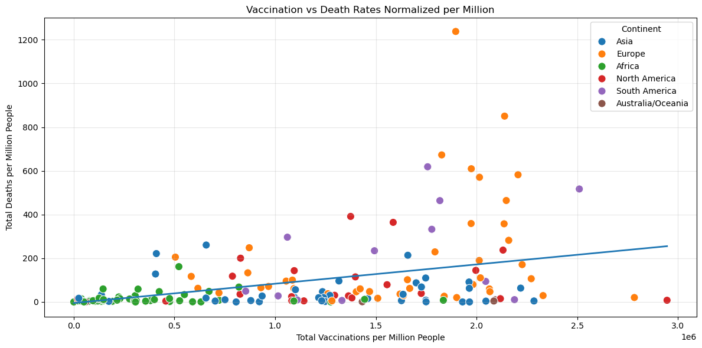

# COVID-19 Vaccination vs Outcomes: Exploratory Analysis

Group project that explores whether countries with higher vaccination totals had fewer COVID-19 deaths, written as clean, defensive Python.

**Tools:** Python · pandas · NumPy · matplotlib · seaborn

## Highlights
- Reusable cleaning functions with **type annotations, docstrings and input/output validation**
- A **custom `DataValidationError` exception** so bad input fails clearly instead of crashing
- EDA: cases per 1M distribution, global vaccine frequency and vaccination growth by country over time
- Correlation heatmap, vaccinations vs cases/deaths, and a **hypothesis test**: *is there a negative correlation between total vaccinations and total deaths?*

## Findings


Country-level data **did not show the expected negative relationship**. After normalising per million people, the trend between vaccinations and deaths is slightly *positive*. This is a classic case of **confounding**. Countries with high vaccination rates (mostly in Europe) also tend to have older populations, more testing and more complete death reporting, and they vaccinated *after* big early waves. The raw cumulative data can't separate those effects.

A fairer test would compare fatality rates over time within each country, or control for age structure and variant period.

## Data
`data/country_vaccinations.csv` and `data/worldometer_data.csv` (public Kaggle COVID-19 datasets).

## Run it
```bash
pip install pandas numpy matplotlib seaborn jupyter
jupyter notebook covid19_analysis.ipynb
```

## Team
Chetan Babu Mahendiran · Micheal Kennedy · David Compagno · Shahmeer Khan

---
*MSc Data Science & Analytics, Munster Technological University (Python for Data Analytics)*
